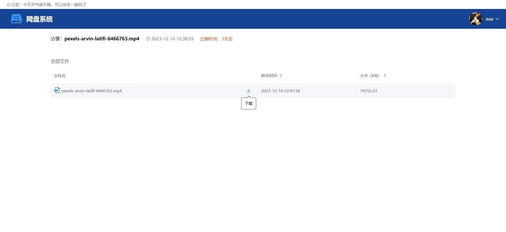
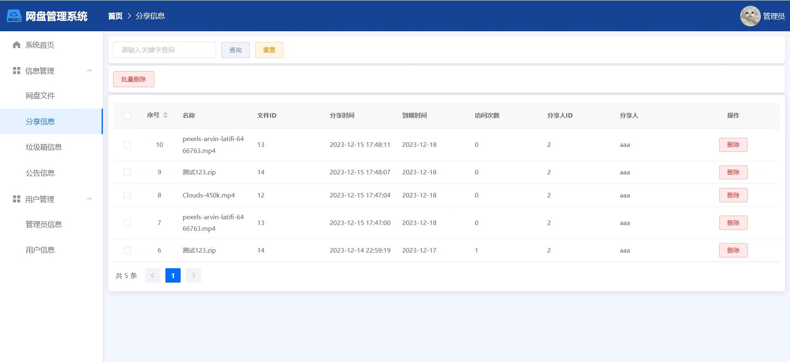
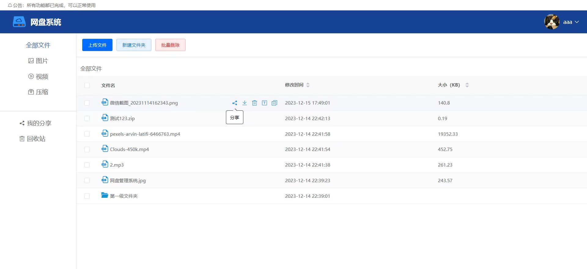
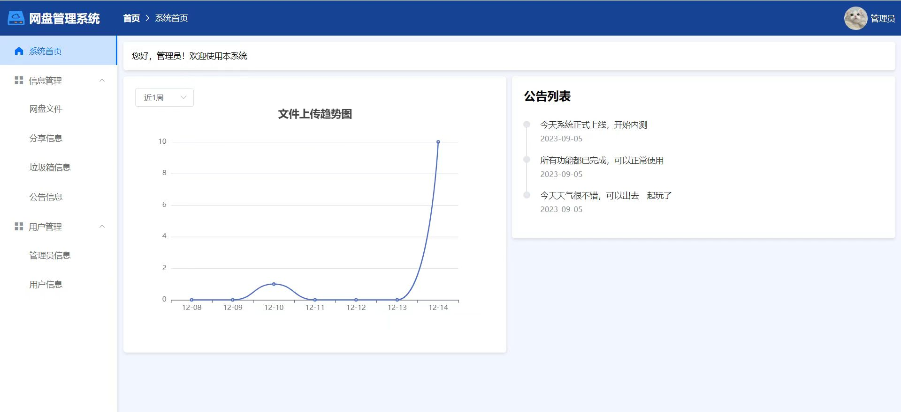
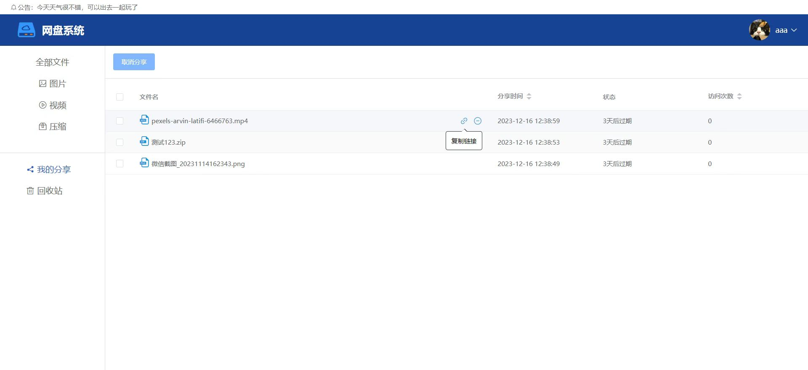

### 一、项目概述
1. **项目名称**：基于Springboot + Vue的个人网盘系统
2. **项目类型**：文件存储与管理平台（前后端分离）
3. **目标用户**：
   - **管理员**：负责平台整体运营和管理的人员。
   - **普通用户**：使用平台进行文件上传、下载、分享等操作的注册用户。
4. **功能模块**：
   - 用户注册/登录（带滑块验证）
   - 文件上传、新建文件夹（可包含子文件/文件夹）、查询所有文件/文件夹、递归复制文件、下载文件、重命名文件/文件夹
   - 分类展示文件（全部、图片、视频、压缩文件等）
   - 分享文件（可设置天数）、取消分享、未登录可查看分享文件、下载分享文件
   - 移入回收站、还原文件、永久删除文件
   - 个人信息管理、修改密码
   - 管理员额外功能：
     - 查看文件上传趋势统计图
     - 网盘文件管理
     - 分享管理
     - 垃圾箱管理
     - 公告信息管理
     - 管理员信息管理
     - 用户管理
---

### 二、环境搭建
#### 1. 开发工具
- **后端**
  - **IntelliJ IDEA** 或其他支持Java开发的IDE（如Eclipse）：用于编写和调试后端代码。  
- **前端**
  - **Visual Studio Code (VS Code)**：轻量级且功能强大的文本编辑器，适合前端开发，提供了丰富的插件支持。  
- **数据库设计与管理**
  - **Navicat Premium**（建议版本不低于16）：可视化工具，用于设计和管理MySQL数据库，简化数据库操作。
#### 2. 开发环境
- **JDK**
  - **版本要求**：1.8
  - **安装说明**：确保正确安装并配置JAVA_HOME环境变量，以便命令行和其他工具能够识别JDK。 
- **Node.js**
  - **版本要求**：16.0+
  - **安装说明**：通过官方提供的安装包进行安装，并确保npm（Node.js的包管理工具）也一并安装，方便后续安装前端依赖。  
- **Maven**
  - **版本要求**：3.8+
  - **安装说明**：Maven是Java项目的构建工具，负责管理项目依赖和执行构建生命周期任务。确保MAVEN_HOME环境变量已设置，并将`bin`目录添加到系统路径中。
#### 3. 数据库环境
- **MySQL**
  - **版本要求**：5.7或8.0
  - **安装说明**：根据操作系统选择合适的MySQL安装包，并完成安装。配置数据库连接参数，确保应用程序可以正常访问数据库。
#### 4. 第三方中间件及工具
- **Redis**：用于缓存数据，如验证码、用户会话信息等。
- **Nginx**：作为反向代理服务器，分发请求至不同的后端服务；同时也可以用于负载均衡和静态资源的托管。
- **Git**：版本控制系统，用于代码管理和协作开发。
---

### 三、项目结构

#### 1. 后端项目结构
- `src/main/java`：存放Java源代码，细分为以下子包：
  - `controller`：包含所有RESTful API控制器类，负责处理HTTP请求。
  - `service`：实现业务逻辑的服务层接口和实现类。
  - `mapper`：定义与数据库交互的持久层接口（MyBatis Mapper）。
  - `entity`：存放实体类，对应数据库中的表结构。
  - `dto`：数据传输对象，用于封装API请求和响应的数据。
  - `vo`：视图对象，专门用于前端展示的数据模型。
  - `exception`：自定义异常类及其处理器。
  - `utils`：工具类，提供通用的功能方法，如日期格式化、字符串处理等。 
- `src/main/resources`：存放非Java资源文件，包括但不限于：
  - `application.properties` 或 `application.yml`：Spring Boot应用配置文件。
  - `mapper.xml`：MyBatis SQL映射文件。
  - 其他静态资源或模板文件（如邮件模板）。 
- `src/test/java`：存放单元测试和集成测试代码，确保各个组件的功能正确性。

#### 2. 前端项目结构
- `src/assets`：存放静态资源，如图片、图标、样式文件（CSS/SCSS）等。
- `src/components`：存放可复用的Vue组件，这些组件可以在不同的页面中使用，提高代码的复用性和开发效率。
- `src/router`：存放路由配置文件，定义了应用的所有路由规则以及它们对应的组件。
- `src/store`：存放Vuex状态管理的相关文件，包括状态、突变、动作等，以集中管理和共享全局状态。
- `src/views`：存放页面级组件，每个页面通常对应一个独立的Vue组件，包含了页面特有的逻辑和布局。
- `src/api`：存放与后端交互的API请求相关代码，通过Axios库发送HTTP请求并与后端通信。
- `src/utils`：存放前端工具类代码，提供辅助函数或常量定义，帮助简化开发过程。
- `src/App.vue`：应用的根组件，是整个应用的入口点，包含了主模板和全局配置。
- `src/main.js`：应用的入口文件，负责初始化Vue实例并挂载到DOM元素上，同时引入全局插件和其他必要的设置。
---

### 四、项目创新
#### 1. **仿百度网盘开发**
- **创新描述**：项目完全模仿百度网盘的功能和界面设计，相似度达到80%，为用户提供熟悉的操作体验。
#### 2. **多层递归查询、复制、删除**
- **创新描述**：实现了对文件夹和文件的多层递归查询、复制和删除功能，极大地提高了文件管理的灵活性和效率。
- **技术实现**：利用深度优先搜索算法遍历文件树结构，确保即使在复杂的嵌套层次下也能高效地完成操作。
#### 3. **登录使用图形验证码**
- **创新描述**：为了增强系统的安全性，采用了图形验证码机制来防止自动化脚本攻击。
- **技术实现**：集成了滑块验证组件，用户需要完成滑动验证才能成功登录，增加了账户的安全性。
#### 4. **巧妙的数据库关联设计**
- **创新描述**：通过精心设计的数据库表结构，实现了高效的文件关联查询，减少了冗余数据。
- **技术实现**：例如，使用外键约束和索引来优化查询性能，确保即使在大数据量的情况下也能保持良好的响应速度。
#### 5. **使用统计图表展示数据变化**
- **创新描述**：管理员可以通过直观的统计图表了解文件上传的趋势，辅助决策。
- **技术实现**：集成ECharts图表库，在后台管理系统中动态展示各种统计数据，如每日文件上传量、用户活跃度等。
---

### 五、功能模块实现
#### 普通用户功能
1. **注册、登录（带滑块验证）**
   - 实现用户注册、登录功能，采用滑块验证提升安全性和用户体验。  
2. **文件操作**
   - 上传文件、新建文件夹（可包含子文件/文件夹）、查询所有文件/文件夹、递归复制文件、下载文件、重命名文件/文件夹。   
3. **分类展示文件**
   - 根据文件类型（全部、图片、视频、压缩文件等）分类展示文件，方便查找。   
4. **分享文件**
   - 支持分享文件并设置有效期，未登录用户也可查看和下载分享文件。   
5. **回收站管理**
   - 提供移入回收站、还原文件、永久删除文件等功能，保护误删的文件。
6. **个人信息管理、修改密码**
   - 用户可以查看和修改自己的个人信息，保障账户安全。

#### 管理员功能
1. **登录、个人信息、修改密码**
   - 实现管理员登录、个人信息查看和修改密码功能。  
2. **文件上传趋势统计图**
   - 查看文件上传趋势统计图，了解平台文件增长情况。  
3. **网盘文件管理**
   - 管理平台上所有用户的文件，包括批量操作和权限控制。  
4. **分享管理**
   - 审核和管理用户分享的文件链接，确保合规性。   
5. **垃圾箱管理**
   - 管理被删除文件的临时存储区，定期清理不再需要的文件。   
6. **公告信息管理**
   - 发布和管理系统公告，及时传达重要信息给用户。   
7. **管理员信息管理**
   - 查看和管理管理员账号信息，分配不同级别的权限。   
8. **用户管理**
   - 查看和管理普通用户信息，保障平台的安全运行。
---

